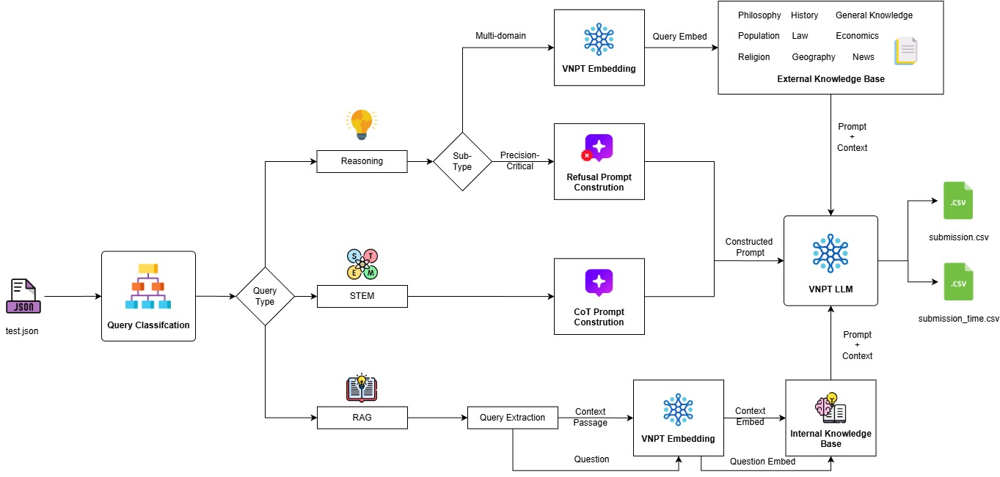

# VNPT AI Hackathon – Track 2: The Builder

## Đội Oversitting – Pipeline LLM End-to-End

---

## 1. Giới thiệu

Repository này chứa **toàn bộ lời giải chính thức của đội Oversitting** cho cuộc thi  
**VNPT AI – Age of AInicorns – Track 2 (The Builder)**.

Hệ thống được thiết kế dưới dạng **pipeline End-to-End chạy trong Docker**, tự động:

- Đọc dữ liệu từ `private_test.json`
- Phân loại câu hỏi theo đúng loại bài toán
- Gọi mô-đun giải tương ứng
- Sinh ra file kết quả `submission.csv` theo đúng định dạng BTC yêu cầu

Giải pháp tập trung vào:

- Phân luồng chính xác (RAG / STEM / Reasoning)
- Sử dụng hợp lý VNPT LLM Small & Large
- Chạy ổn định trong môi trường Docker giống hệt máy chấm của BTC

---

## 2. Luồng xử lý tổng thể (Pipeline Flow)

Hệ thống vận hành theo cơ chế **Dynamic Routing**, tự động điều hướng câu hỏi dựa trên đặc tính nội dung để tối ưu hóa tài nguyên và độ chính xác:


_(Hình 1: Sơ đồ luồng xử lý tổng thể của hệ thống Oversitting)_

- **Router (Hybrid):** Kết hợp Heuristic và LLM (Few-shot) để phân loại câu hỏi ngay từ đầu vào thành 3 nhóm: STEM, RAG, và Reasoning.
- **RAG Solver:** Sử dụng **VNPT Embedding** và **FAISS** để trích xuất thông tin từ ngữ cảnh nội bộ (Internal Context) hoặc tài liệu đính kèm với Top K=3.
- **STEM Solver:** Tập trung vào **LLM Small** kết hợp với kỹ thuật **Chain-of-Thought (CoT)** để giải quyết các bài toán logic và tính toán theo từng bước.
- **Reasoning Solver:** Sử dụng **LLM Large** truy vấn kho tri thức ngoại lực (External Knowledge Base) đa lĩnh vực được index sẵn.

---

📄 **Xem chi tiết mô tả kỹ thuật và Prompt cho từng Pipeline tại:**
👉 [Full Technical Report - Oversitting System](./technical_report_Oversiting.pdf)
👉 [Full Technical Report - Oversitting System (Link Drive dự phòng)](https://drive.google.com/file/d/1vddqkUYMh5d-Q7RNeOKRn9TOOSllKSGt/view?usp=sharing)

---

## 3. Chiến lược sử dụng mô hình

| Loại câu hỏi | Mô hình                    |
| ------------ | -------------------------- |
| STEM         | vnptai_hackathon_small     |
| RAG          | vnptai_hackathon_large     |
| Reasoning    | vnptai_hackathon_large     |
| Embedding    | vnptai_hackathon_embedding |

---

## 4. Mô-đun RAG (Cốt lõi)

- Vector Database: FAISS
- Embedding: VNPT Embedding API
- Truy hồi Top-k cosine similarity
- Sinh đáp án bằng VNPT LLM Large

> Lưu ý: FAISS index không lưu trong GitHub do vượt 100MB,
> mà đã được đóng gói sẵn trong Docker image.

---

## 5. Cấu trúc thư mục

```
VNPT_AI/
├── Dockerfile
├── inference.sh
├── predict.py
├── requirements.txt
├── README.md
├── src/
│   ├── router.py
│   ├── RAG/
│   ├── STEM/
│   └── Reasoning/
```

---

## 6. Docker

- Base image: nvidia/cuda:12.2.0-devel-ubuntu20.04
- Chạy ổn định trên GPU của BTC

---

## 7. Cách BTC chấm bài

1. Mount `private_test.json` vào `/code/private_test.json`
2. Chạy container
3. Sinh `submission.csv`
4. Kết thúc

```bash
docker run --gpus all \
  -v /path/to/private_test.json:/code/private_test.json \
  danai39/oversitting_submission:final
```

---

## 8. Định dạng output

```csv
qid,answer
1,A
2,B
```

---

## 9. Biến môi trường

Hệ thống sử dụng các biến môi trường do BTC cung cấp:

- API_URL_SMALL, AUTH_SMALL, TOKEN_ID_SMALL, TOKEN_KEY_SMALL
- API_URL_LARGE, AUTH_LARGE, TOKEN_ID_LARGE, TOKEN_KEY_LARGE
- API_URL_EMBED, AUTH_EMBED, TOKEN_ID_EMBED, TOKEN_KEY_EMBED

---

## 10. Thông tin nộp bài

- GitHub Repository (public)
- Docker Hub Image:

```
danai39/oversitting_submission:final
```

---

## 11. Lời cảm ơn

Xin cảm ơn **VNPT AI** và BTC đã tổ chức cuộc thi ý nghĩa.

**Đội Oversitting**
